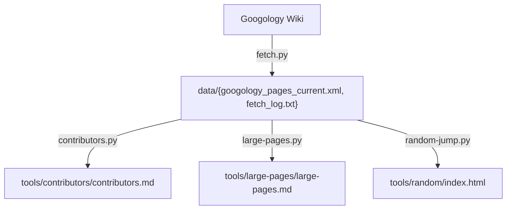

# GoogolBook LM
Googology Wiki LLM support

## Features

- **[fetch](tools/fetch/README.md)** - Downloads and extracts the official Googology Wiki XML export archive from the Wikia/Fandom servers.
- **[analysis large pages](tools/large-pages/README.md)** - Identifies and analyzes the largest pages in the Googology Wiki by content size, providing detailed statistics and direct links to original wiki pages.
- **[contributors](tools/contributors/README.md)** - Analyzes contributors by page creation count to identify the most active content creators in the Googology Wiki.
- **[random page selector](tools/random/README.md)** - Generates an interactive HTML page with a button to jump to random Googology Wiki pages for content discovery.

## Data Processing Flow

