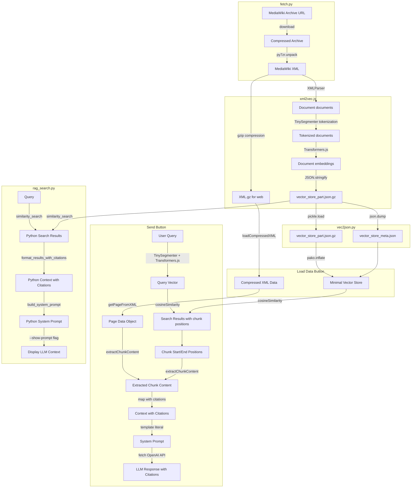

# GoogolBook LM

A RAG-powered Q&A system for Googology Wiki content. This system uses Retrieval-Augmented Generation (RAG) to provide accurate answers about googology concepts by searching through wiki content and generating responses with LLM assistance.

## Overview

GoogolBook LM enables users to ask questions about googology and receive AI-generated answers backed by actual wiki sources. The system searches through vectorized wiki content to find relevant information before generating responses.

## Live Demo

Try the system online:
- **English Version**: [https://koteitan.github.io/googolbook-lm/data/googology-wiki/](https://koteitan.github.io/googolbook-lm/data/googology-wiki/)
- **Japanese Version**: [https://koteitan.github.io/googolbook-lm/data/ja-googology-wiki/](https://koteitan.github.io/googolbook-lm/data/ja-googology-wiki/)

## Data Sources

This system uses content from:
- [Googology Wiki](https://googology.fandom.com/) - The English googology community wiki
- [巨大数研究 Wiki](https://googology.fandom.com/ja/) - The Japanese googology community wiki

## System Architecture

The RAG system follows a clear data processing pipeline from MediaWiki XML dumps to searchable vector representations:



## Multi-Site Architecture

The project supports multiple wiki sites with independent interfaces:

- **English Googology Wiki**: `/data/googology-wiki/index.html`
- **Japanese Googology Wiki**: `/data/ja-googology-wiki/index.html`

Each site features:
- Site-specific configuration (`config.yml`)
- Pre-processed vector store data files
- Localized user interface
- Independent RAG search functionality

Shared components are located in the root directory (`index.css`) and lib directory (`lib/rag-common.js`).

## Requirements

### Python Backend (optional, for XML processing)
Python 3.x is required only if using Python tools:

```bash
# For data fetching (tools/fetch/)
pip install py7zr

# For RAG system (tools/rag/ - Python version)
pip install langchain langchain-community langchain-text-splitters langchain-openai
pip install langchain-huggingface  # For HuggingFace embeddings
pip install faiss-cpu  # or faiss-gpu for GPU support
pip install sentence-transformers  # For HuggingFace model downloads
pip install lxml  # For XML parsing
pip install mwxml  # For MediaWiki XML parsing
pip install mwparserfromhell  # For MediaWiki markup parsing
```

### Node.js Frontend (recommended)
For the unified JavaScript/Node.js workflow:

```bash
npm install  # Installs @xenova/transformers and other dependencies
```

The system now supports two approaches:
1. **Node.js-only**: Use `tools/rag/xml2vec.js` for consistent embedding generation
2. **Python backend**: Use `tools/rag/xml2vec.py` + `tools/rag/vec2json.py` (legacy)

For detailed tool-specific documentation, see:
- [tools/fetch/README.md](tools/fetch/README.md) - Data fetching tool
- [tools/rag/README.md](tools/rag/README.md) - RAG system implementation

## Library

See [lib/README.md](lib/README.md) for detailed documentation of the analysis library functions.

## Tools

See [tools/README.md](tools/README.md) for available analysis tools and data processing flow.
