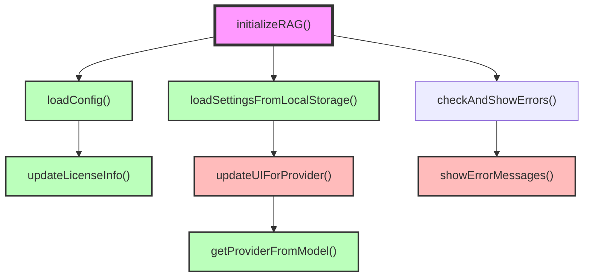
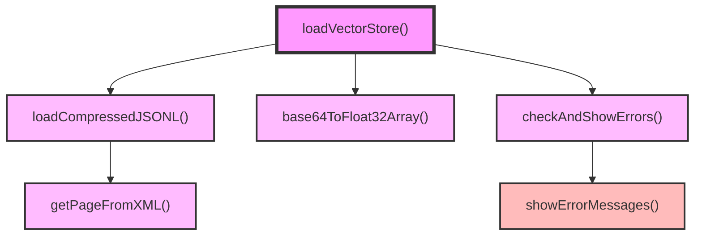

# lib/rag-common.js Function Call Graph

## イベントハンドラ

### 1. ページ読み込み
- `initializeRAG(currentSite)`

### 2. Load Dataボタン押下
- `loadVectorStore()`

### 3. Sendボタン押下 / Ctrl+Enter
- `handleSend()`

## UIアクセス

UIへの入力取得・出力設定を行う関数:

1. `getCurrentModel(elements)` - 現在選択されているモデルを取得
   - LLM Model: `elements.modelSelect.value` (`document.getElementById('model-select')`)

2. `updateLicenseInfo(config, elements)` - ライセンス情報を更新
   - License Link表示: `elements.licenseLink.textContent` (`document.getElementById('license-link')`)
   - Fetch Date表示: `elements.fetchDate.textContent` (`document.getElementById('fetch-date')`)

3. `loadVectorStore()` - ベクトルストアを読み込み
   - Load Data Button無効化: `elements.loadDataBtn.disabled` (`document.getElementById('load-data-btn')`)
   - Loading Progress CSS: `elements.loadingProgress.classList`, `elements.loadingProgress.style` (`document.getElementById('loading-progress')`)
   - Loading Status表示: `elements.loadingStatus.textContent` (`document.getElementById('loading-status')`)

4. `showErrorMessages()` - エラーメッセージを表示
   - Error Messages表示: `elements.errorMessages.innerHTML` (`document.getElementById('error-messages')`)

5. `clearErrorMessages()` - エラーメッセージをクリア
   - Error Messages消去: `elements.errorMessages.innerHTML` (`document.getElementById('error-messages')`)

6. `checkAndShowErrors()` - エラーをチェックして表示
   - API Base URL: `elements.baseUrl.value.trim()` (`document.getElementById('base-url')`)
   - API Key: `elements.apiKey.value.trim()` (`document.getElementById('api-key')`)
   - Send Button無効化制御: `elements.sendBtn.disabled` (`document.getElementById('send-btn')`)

7. `handleSend()` - 送信ハンドラー
   - 質問文: `elements.promptWindow.value.trim()` (`document.getElementById('prompt-window')`)
   - Response Window表示: `elements.responseWindow.innerHTML` (`document.getElementById('response-window')`)
   - RAG Window表示: `elements.ragWindow.innerHTML` (`document.getElementById('rag-window')`)
   - Send Button無効化: `elements.sendBtn.disabled` (`document.getElementById('send-btn')`)
   - Prompt Window無効化: `elements.promptWindow.disabled` (`document.getElementById('prompt-window')`)

8. `extractSearchKeywords(query, apiKey, elements)` - 検索キーワードを抽出
   - API Base URL: `elements.baseUrl.value.trim()` (`document.getElementById('base-url')`)
   - LLM Model: `elements.modelSelect.value.trim()` (`document.getElementById('model-select')`)
   - API Key: `apiKey` (引数として受け取る)

9. `processSearchAndResponse()` - 検索とレスポンスを処理
   - API Key: `elements.apiKey.value.trim()` (`document.getElementById('api-key')`)
   - 質問文: `query` (引数として受け取る)
   - RAG Window表示: `elements.ragWindow.innerHTML` (`document.getElementById('rag-window')`)
   - Response Window表示: `elements.responseWindow.innerHTML` (`document.getElementById('response-window')`)
   - Prompt Window無効化解除: `elements.promptWindow.disabled` (`document.getElementById('prompt-window')`)

10. `displayRAGResults()` - RAG検索結果を表示
    - RAG Window表示: `elements.ragWindow.innerHTML` (`document.getElementById('rag-window')`)

11. `displayLLMPrompt(systemPrompt, userQuery, elements, ...)` - LLMプロンプトを表示（デバッグ用）
    - Debug Info表示: `elements.debugInfoContent.innerHTML` (`document.getElementById('debug-info-content')`)
    - System Prompt表示: `elements.systemPromptContent.textContent` (`document.getElementById('system-prompt-content')`)
    - User Query表示: `elements.userQueryContent.textContent` (`document.getElementById('user-query-content')`)
    - Debug Section表示制御: `elements.debugSection.style.display` (`document.getElementById('llm-prompt-debug-section')`)

12. `generateAIResponse()` - AI応答を生成
    - API Base URL: `elements.baseUrl.value.trim()` (`document.getElementById('base-url')`)
    - API Key: `apiKey` (引数として受け取る)
    - Response Window表示: `elements.responseWindow.innerHTML` (`document.getElementById('response-window')`)

13. `saveSettingsToLocalStorage()` - 設定をlocalStorageに保存
    - API Base URL: `elements.baseUrl.value.trim()` (`document.getElementById('base-url')`)
    - LLM Model: `elements.modelSelect?.value` (`document.getElementById('model-select')`)

14. `loadSettingsFromLocalStorage()` - localStorageから設定を読み込み
    - API Base URL: `elements.baseUrl.value` (`document.getElementById('base-url')`)に設定
    - LLM Model: `elements.modelSelect.value` (`document.getElementById('model-select')`)に設定

15. `initializeRAG()` - RAGシステムを初期化
    - API Base URL: `elements.baseUrl.value` (`document.getElementById('base-url')`)に初期値設定
    - LLM Model: `elements.modelSelect.value` (`document.getElementById('model-select')`)に初期値設定
    - Loading Status表示: `elements.loadingStatus.textContent` (`document.getElementById('loading-status')`)
    - Prompt Window復元: `elements.promptWindow.value` (`document.getElementById('prompt-window')`)

16. `updateUIForProvider()` - プロバイダーに応じてUIを更新
    - API Base URL: `elements.baseUrl.value` (`document.getElementById('base-url')`)を条件により更新
    - Base URL Placeholder: `elements.baseUrl.placeholder` (`document.getElementById('base-url')`)
    - API Key Placeholder: `elements.apiKey.placeholder` (`document.getElementById('api-key')`)
    - API Key Help表示: `elements.apiKeyHelp.innerHTML` (`document.getElementById('api-key-help')`)

## Function Call Graph (Mermaid)

### 1. ページ読み込み時

### 2. Load Dataボタン押下時

### 3. Sendボタン押下時

```mermaid
graph TD
    handleSend["handleSend()"]
    
    handleSend --> processSearchAndResponse["processSearchAndResponse()"]
    handleSend --> checkAndShowErrors["checkAndShowErrors()"]
    
    processSearchAndResponse --> extractSearchKeywords["extractSearchKeywords()"]
    processSearchAndResponse --> performMultiKeywordSearch["performMultiKeywordSearch()"]
    processSearchAndResponse --> findOptimalDocumentNumbers["findOptimalDocumentNumbers()"]
    processSearchAndResponse --> displayRAGResults["displayRAGResults()"]
    processSearchAndResponse --> generateAIResponse["generateAIResponse()"]
    processSearchAndResponse --> displayLLMPrompt["displayLLMPrompt()"]
    
    extractSearchKeywords --> callLLMAPI["callLLMAPI()"]
    performMultiKeywordSearch --> cosineSimilarity["cosineSimilarity()"]
    findOptimalDocumentNumbers --> calculateRequiredTokens["calculateRequiredTokens()"]
    generateAIResponse --> getCurrentModel["getCurrentModel()"]
    generateAIResponse --> getPromptSizeLimit["getPromptSizeLimit()"]
    generateAIResponse --> processSearchResultContent["processSearchResultContent()"]
    generateAIResponse --> callLLMAPI
    
    callLLMAPI --> getProviderFromModel["getProviderFromModel()"]
    callLLMAPI --> callOpenAIAPI["callOpenAIAPI()"]
    callLLMAPI --> callClaudeAPI["callClaudeAPI()"]
    callLLMAPI --> callGeminiAPI["callGeminiAPI()"]
    callLLMAPI --> callOpenRouterAPI["callOpenRouterAPI()"]
    callLLMAPI --> callAzureOpenAIAPI["callAzureOpenAIAPI()"]
    
    checkAndShowErrors --> showErrorMessages["showErrorMessages()"]
    
    classDef entry fill:#f9f,stroke:#333,stroke-width:4px
    classDef api fill:#bbf,stroke:#333,stroke-width:2px
    classDef ui fill:#fbb,stroke:#333,stroke-width:2px
    classDef search fill:#bfb,stroke:#333,stroke-width:2px
    
    class handleSend entry
    class callLLMAPI,callOpenAIAPI,callClaudeAPI,callGeminiAPI,callOpenRouterAPI,callAzureOpenAIAPI api
    class showErrorMessages,displayRAGResults,displayLLMPrompt ui
    class processSearchAndResponse,extractSearchKeywords,performMultiKeywordSearch,findOptimalDocumentNumbers,generateAIResponse,cosineSimilarity,calculateRequiredTokens,getCurrentModel,getPromptSizeLimit,processSearchResultContent,getProviderFromModel,checkAndShowErrors search
```
