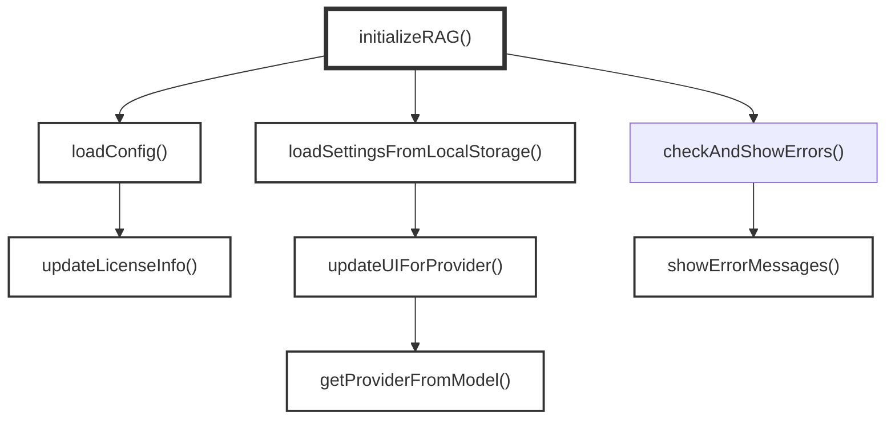
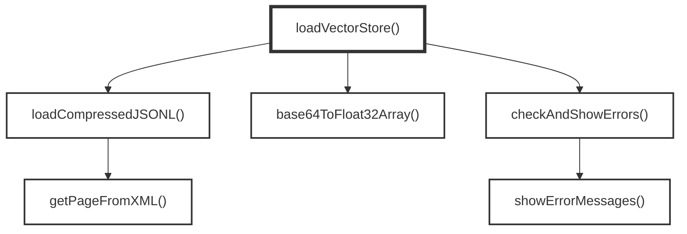

# lib/rag-common.js Function Call Graph

## イベントハンドラ

### 1. ページ読み込み
- `initializeRAG(currentSite)`

### 2. Load Dataボタン押下
- `loadVectorStore()`

### 3. Sendボタン押下 / Ctrl+Enter
- `handleSend()`

## インターフェース

### 値の取得

UI要素やブラウザオブジェクトから値を取得する関数:

#### elements.baseUrl(APIベースURL)
- `checkAndShowErrors()` - 値を取得してエラーチェック
- `extractSearchKeywords(query, apiKey, elements)` - 値を取得してLLM APIに送信
- `generateAIResponse()` - 値を取得してLLM APIに送信
- `saveSettingsToLocalStorage()` - 値を取得してlocalStorageに保存

#### elements.apiKey(APIキー)
- `checkAndShowErrors()` - 値を取得してエラーチェック
- `processSearchAndResponse()` - 値を取得してAPIキーとして使用

#### elements.modelSelect(LLMモデル)
- `getCurrentModel(elements)` - 現在選択されているモデルを取得
- `extractSearchKeywords(query, apiKey, elements)` - 値を取得してLLM APIに送信
- `saveSettingsToLocalStorage()` - 値を取得してlocalStorageに保存

#### elements.promptWindow(質問入力欄)
- `handleSend()` - 質問文を取得

#### localStorage(ローカルストレージ)
- `loadSettingsFromLocalStorage()` - 保存された設定を取得
- `initializeRAG()` - 最後のクエリを取得

#### window.location(ウィンドウ位置情報)
- `checkAndShowErrors()` - ホスト名を取得してローカルアクセス判定

#### window.lastDocumentSelection(ドキュメント選択情報)
- `getRepresentativeContentFromChunks()` - 最後の文書選択情報を取得

### 値の変更

UI要素やブラウザオブジェクトの値を変更・設定する関数:

#### elements.baseUrl(APIベースURL)
- `loadSettingsFromLocalStorage()` - localStorageから読み込んで値を設定
- `initializeRAG()` - 初期値を設定
- `updateUIForProvider()` - プロバイダーに応じて値とplaceholderを更新

#### elements.apiKey(APIキー)
- `updateUIForProvider()` - placeholderを更新

#### elements.apiKeyHelp(APIキーヘルプ)
- `updateUIForProvider()` - ヘルプテキストを表示

#### elements.debugInfoContent(デバッグ情報コンテンツ)
- `displayLLMPrompt(systemPrompt, userQuery, elements, ...)` - デバッグ情報を表示

#### elements.debugSection(デバッグセクション)
- `displayLLMPrompt(systemPrompt, userQuery, elements, ...)` - 表示制御

#### elements.errorMessages(エラーメッセージ)
- `showErrorMessages()` - エラーメッセージを表示
- `clearErrorMessages()` - エラーメッセージをクリア

#### elements.fetchDate(取得日時)
- `updateLicenseInfo(config, elements)` - 取得日時を表示

#### elements.licenseLink(ライセンスリンク)
- `updateLicenseInfo(config, elements)` - ライセンス情報を表示

#### elements.modelSelect(LLMモデル)
- `loadSettingsFromLocalStorage()` - localStorageから読み込んで値を設定
- `initializeRAG()` - 初期値を設定

#### elements.loadDataBtn(データ読み込みボタン)
- `loadVectorStore()` - ボタンを無効化

#### elements.loadingProgress(読み込み進捗)
- `loadVectorStore()` - CSSクラスとスタイルを制御

#### elements.loadingStatus(読み込み状態)
- `loadVectorStore()` - ステータステキストを表示
- `initializeRAG()` - ステータステキストを表示

#### elements.promptWindow(質問入力欄)
- `handleSend()` - 無効化
- `processSearchAndResponse()` - 無効化解除
- `initializeRAG()` - 値を復元

#### elements.ragWindow(RAG検索結果表示)
- `handleSend()` - RAG検索結果を表示
- `processSearchAndResponse()` - RAG検索結果を表示
- `displayRAGResults()` - RAG検索結果を表示

#### elements.responseWindow(応答表示)
- `handleSend()` - AI応答を表示
- `processSearchAndResponse()` - AI応答を表示
- `generateAIResponse()` - AI応答を表示

#### elements.sendBtn(送信ボタン)
- `checkAndShowErrors()` - 無効化制御
- `handleSend()` - 無効化

#### elements.systemPromptContent(システムプロンプト内容)
- `displayLLMPrompt(systemPrompt, userQuery, elements, ...)` - システムプロンプトを表示

#### elements.userQueryContent(ユーザークエリ内容)
- `displayLLMPrompt(systemPrompt, userQuery, elements, ...)` - ユーザークエリを表示

#### localStorage(ローカルストレージ)
- `saveSettingsToLocalStorage()` - 設定を保存
- `handleSend()` - 最後のクエリを保存

#### window.location(ウィンドウ位置情報)
- `callLLMAPI()` - リファラーヘッダーにオリジンを設定

#### window.lastDocumentSelection(ドキュメント選択情報)
- `findOptimalDocumentNumbers()` - 文書選択情報を保存

#### window.MathJax(数式レンダリング)
- `generateAIResponse()` - 数式のタイプセットを実行

#### document(ドキュメント)
- `initializeRAG()` - 全てのUI要素を取得

## Function Call Graph (Mermaid)

### 1. ページ読み込み時

### 2. Load Dataボタン押下時

### 3. Sendボタン押下時

```mermaid
graph TD
    handleSend["handleSend()"]
    
    handleSend --> processSearchAndResponse["processSearchAndResponse()"]
    handleSend --> checkAndShowErrors["checkAndShowErrors()"]
    
    processSearchAndResponse --> extractSearchKeywords["extractSearchKeywords()"]
    processSearchAndResponse --> performMultiKeywordSearch["performMultiKeywordSearch()"]
    processSearchAndResponse --> findOptimalDocumentNumbers["findOptimalDocumentNumbers()"]
    processSearchAndResponse --> displayRAGResults["displayRAGResults()"]
    processSearchAndResponse --> generateAIResponse["generateAIResponse()"]
    processSearchAndResponse --> displayLLMPrompt["displayLLMPrompt()"]
    
    extractSearchKeywords --> callLLMAPI["callLLMAPI()"]
    performMultiKeywordSearch --> cosineSimilarity["cosineSimilarity()"]
    findOptimalDocumentNumbers --> calculateRequiredTokens["calculateRequiredTokens()"]
    generateAIResponse --> getCurrentModel["getCurrentModel()"]
    generateAIResponse --> getPromptSizeLimit["getPromptSizeLimit()"]
    generateAIResponse --> processSearchResultContent["processSearchResultContent()"]
    generateAIResponse --> callLLMAPI
    
    callLLMAPI --> getProviderFromModel["getProviderFromModel()"]
    callLLMAPI --> callOpenAIAPI["callOpenAIAPI()"]
    callLLMAPI --> callClaudeAPI["callClaudeAPI()"]
    callLLMAPI --> callGeminiAPI["callGeminiAPI()"]
    callLLMAPI --> callOpenRouterAPI["callOpenRouterAPI()"]
    callLLMAPI --> callAzureOpenAIAPI["callAzureOpenAIAPI()"]
    
    checkAndShowErrors --> showErrorMessages["showErrorMessages()"]
    
    classDef entry fill:none,stroke:#333,stroke-width:4px
    classDef api fill:none,stroke:#333,stroke-width:2px
    classDef ui fill:none,stroke:#333,stroke-width:2px
    classDef search fill:none,stroke:#333,stroke-width:2px
    
    class handleSend entry
    class callLLMAPI,callOpenAIAPI,callClaudeAPI,callGeminiAPI,callOpenRouterAPI,callAzureOpenAIAPI api
    class showErrorMessages,displayRAGResults,displayLLMPrompt ui
    class processSearchAndResponse,extractSearchKeywords,performMultiKeywordSearch,findOptimalDocumentNumbers,generateAIResponse,cosineSimilarity,calculateRequiredTokens,getCurrentModel,getPromptSizeLimit,processSearchResultContent,getProviderFromModel,checkAndShowErrors search
```
