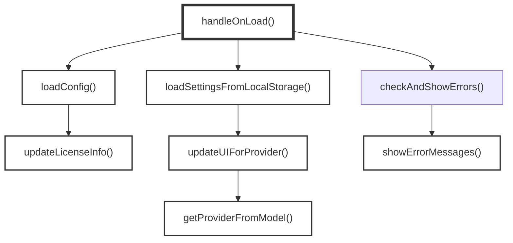
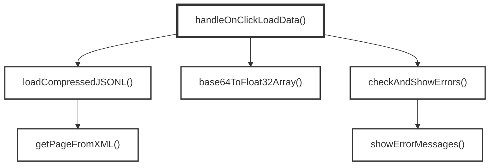

# クライアントサイド JavaScript

## イベントハンドラ

### 1. ページ読み込み(window.onload)
- `handleOnLoad(currentSite)`

### 2. Load Dataボタン押下(button.click)
- `handleOnClickLoadData()`

### 3. Sendボタン押下 / Ctrl+Enter(button.click / keydown)
- `handleOnClickSend()`

## インターフェース

### 値の取得

UI要素やブラウザオブジェクトから値を取得する関数:

- **elements.baseUrl(textbox, APIベースURL)**
  - `checkAndShowErrors()` - 値を取得してエラーチェック
  - `extractSearchKeywords(query, apiKey, elements)` - 値を取得してLLM APIに送信
  - `generateAIResponse()` - 値を取得してLLM APIに送信
  - `saveSettingsToLocalStorage()` - 値を取得してlocalStorageに保存

- **elements.apiKey(textbox, APIキー)**
  - `checkAndShowErrors()` - 値を取得してエラーチェック
  - `processSearchAndResponse()` - 値を取得してAPIキーとして使用

- **elements.modelSelect(select, LLMモデル)**
  - `getCurrentModel(elements)` - 現在選択されているモデルを取得
  - `extractSearchKeywords(query, apiKey, elements)` - 値を取得してLLM APIに送信
  - `saveSettingsToLocalStorage()` - 値を取得してlocalStorageに保存

- **elements.promptWindow(textarea, 質問入力欄)**
  - `handleOnClickSend()` - 質問文を取得

- **elements.localStorage(storage, ローカルストレージ)**
  - `loadState(storage)` - `googolbook-lm:state` から状態オブジェクトを取得(無ければ旧キーから復元)
  - `loadSettingsFromLocalStorage()` - `loadState()` 経由で保存された設定を取得
  - `handleOnLoad()` - `loadState()` 経由で最後のクエリを取得

- **elements.window.location(location, ウィンドウ位置情報)**
  - `checkAndShowErrors()` - ホスト名を取得してローカルアクセス判定

- **elements.window.lastDocumentSelection(object, ドキュメント選択情報)**
  - `getRepresentativeContentFromChunks()` - 最後の文書選択情報を取得

### 値の変更

UI要素やブラウザオブジェクトの値を変更・設定する関数:

- **elements.baseUrl(textbox, APIベースURL)**
  - `loadSettingsFromLocalStorage()` - localStorageから読み込んで値を設定
  - `handleOnLoad()` - 初期値を設定
  - `updateUIForProvider()` - プロバイダーに応じて値とplaceholderを更新

- **elements.apiKey(textbox, APIキー)**
  - `updateUIForProvider()` - placeholderを更新

- **elements.apiKeyHelp(div, APIキーヘルプ)**
  - `updateUIForProvider()` - ヘルプテキストを表示

- **elements.debugInfoContent(div, デバッグ情報コンテンツ)**
  - `displayLLMPrompt(systemPrompt, userQuery, elements, ...)` - デバッグ情報を表示

- **elements.debugSection(div, デバッグセクション)**
  - `displayLLMPrompt(systemPrompt, userQuery, elements, ...)` - 表示制御

- **elements.errorMessages(div, エラーメッセージ)**
  - `showErrorMessages()` - エラーメッセージを表示
  - `clearErrorMessages()` - エラーメッセージをクリア

- **elements.fetchDate(span, 取得日時)**
  - `updateLicenseInfo(config, elements)` - 取得日時を表示

- **elements.licenseLink(a, ライセンスリンク)**
  - `updateLicenseInfo(config, elements)` - ライセンス情報を表示

- **elements.modelSelect(select, LLMモデル)**
  - `loadSettingsFromLocalStorage()` - localStorageから読み込んで値を設定
  - `handleOnLoad()` - 初期値を設定

- **elements.loadDataBtn(button, データ読み込みボタン)**
  - `handleOnClickLoadData()` - ボタンを無効化

- **elements.loadingProgress(div, 読み込み進捗)**
  - `handleOnClickLoadData()` - CSSクラスとスタイルを制御

- **elements.loadingStatus(div, 読み込み状態)**
  - `handleOnClickLoadData()` - ステータステキストを表示
  - `handleOnLoad()` - ステータステキストを表示

- **elements.promptWindow(textarea, 質問入力欄)**
  - `handleOnClickSend()` - 無効化
  - `processSearchAndResponse()` - 無効化解除
  - `handleOnLoad()` - 値を復元

- **elements.ragWindow(div, RAG検索結果表示)**
  - `handleOnClickSend()` - RAG検索結果を表示
  - `processSearchAndResponse()` - RAG検索結果を表示
  - `displayRAGResults()` - RAG検索結果を表示

- **elements.responseWindow(div, 応答表示)**
  - `handleOnClickSend()` - AI応答を表示
  - `processSearchAndResponse()` - AI応答を表示
  - `generateAIResponse()` - AI応答を表示

- **elements.sendBtn(button, 送信ボタン)**
  - `checkAndShowErrors()` - 無効化制御
  - `handleOnClickSend()` - 無効化

- **elements.systemPromptContent(pre, システムプロンプト内容)**
  - `displayLLMPrompt(systemPrompt, userQuery, elements, ...)` - システムプロンプトを表示

- **elements.userQueryContent(pre, ユーザークエリ内容)**
  - `displayLLMPrompt(systemPrompt, userQuery, elements, ...)` - ユーザークエリを表示

- **elements.localStorage(storage, ローカルストレージ)**
  - `saveState(storage, patch)` - `googolbook-lm:state` に状態オブジェクトをマージして保存
  - `saveSettingsToLocalStorage()` - `saveState()` 経由で設定(`ragSettings`)を保存
  - `handleOnClickSend()` - `saveState()` 経由で最後のクエリ(`lastQuery`)を保存

- **elements.window.location(location, ウィンドウ位置情報)**
  - `callLLMAPI()` - リファラーヘッダーにオリジンを設定

- **elements.window.lastDocumentSelection(object, ドキュメント選択情報)**
  - `findOptimalDocumentNumbers()` - 文書選択情報を保存

- **elements.window.MathJax(object, 数式レンダリング)**
  - `generateAIResponse()` - 数式のタイプセットを実行

## localStorage のキー名前空間

全サイトが `https://koteitan.github.io/` という単一オリジンを共有するため、
localStorage のキーはリポジトリ名で名前空間を切る。

- キー: `googolbook-lm:state` (JSON オブジェクト1個)
  - `lastQuery` (string) - 最後に送信した質問文
  - `ragSettings` (object) - `{ baseUrl, model }`
- アクセスは `loadState(storage)` / `saveState(storage, patch)` ヘルパ経由のみ。
  `elements.localStorage` の DI ラッパはそのまま維持する。
- 旧キー `lastQuery` / `ragSettings` は読み込み時のフォールバックとしてのみ参照し、
  削除はしない。保存は常に新キーへ行う。

- **elements.document(document, ドキュメント)**
  - `handleOnLoad()` - 全てのUI要素を取得

## Function Call Graph (Mermaid)

### 1. ページ読み込み時

### 2. Load Dataボタン押下時

### 3. Sendボタン押下時

```mermaid
graph TD
    handleOnClickSend["handleOnClickSend()"]
    
    handleOnClickSend --> processSearchAndResponse["processSearchAndResponse()"]
    handleOnClickSend --> checkAndShowErrors["checkAndShowErrors()"]
    
    processSearchAndResponse --> extractSearchKeywords["extractSearchKeywords()"]
    processSearchAndResponse --> performMultiKeywordSearch["performMultiKeywordSearch()"]
    processSearchAndResponse --> findOptimalDocumentNumbers["findOptimalDocumentNumbers()"]
    processSearchAndResponse --> displayRAGResults["displayRAGResults()"]
    processSearchAndResponse --> generateAIResponse["generateAIResponse()"]
    processSearchAndResponse --> displayLLMPrompt["displayLLMPrompt()"]
    
    extractSearchKeywords --> callLLMAPI["callLLMAPI()"]
    performMultiKeywordSearch --> cosineSimilarity["cosineSimilarity()"]
    findOptimalDocumentNumbers --> calculateRequiredTokens["calculateRequiredTokens()"]
    generateAIResponse --> getCurrentModel["getCurrentModel()"]
    generateAIResponse --> getPromptSizeLimit["getPromptSizeLimit()"]
    generateAIResponse --> processSearchResultContent["processSearchResultContent()"]
    generateAIResponse --> callLLMAPI
    
    callLLMAPI --> getProviderFromModel["getProviderFromModel()"]
    callLLMAPI --> callOpenAIAPI["callOpenAIAPI()"]
    callLLMAPI --> callClaudeAPI["callClaudeAPI()"]
    callLLMAPI --> callGeminiAPI["callGeminiAPI()"]
    callLLMAPI --> callOpenRouterAPI["callOpenRouterAPI()"]
    callLLMAPI --> callAzureOpenAIAPI["callAzureOpenAIAPI()"]
    
    checkAndShowErrors --> showErrorMessages["showErrorMessages()"]
    
    classDef entry fill:none,stroke:#333,stroke-width:4px
    classDef api fill:none,stroke:#333,stroke-width:2px
    classDef ui fill:none,stroke:#333,stroke-width:2px
    classDef search fill:none,stroke:#333,stroke-width:2px
    
    class handleOnClickSend entry
    class callLLMAPI,callOpenAIAPI,callClaudeAPI,callGeminiAPI,callOpenRouterAPI,callAzureOpenAIAPI api
    class showErrorMessages,displayRAGResults,displayLLMPrompt ui
    class processSearchAndResponse,extractSearchKeywords,performMultiKeywordSearch,findOptimalDocumentNumbers,generateAIResponse,cosineSimilarity,calculateRequiredTokens,getCurrentModel,getPromptSizeLimit,processSearchResultContent,getProviderFromModel,checkAndShowErrors search
```

