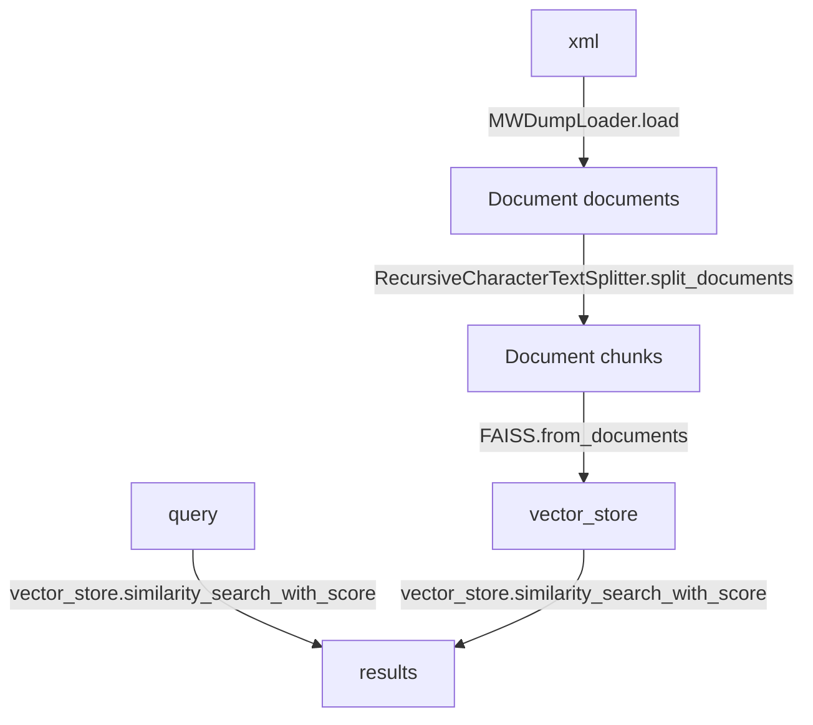

# LangChain RAG System Specification

## RAG Processing Flow

The LangChain RAG system follows a clear data processing pipeline from MediaWiki XML dumps to searchable vector representations:

### Function References

* **MWDumpLoader**
  * How To: [MediaWiki Dump Loader](https://python.langchain.com/docs/integrations/document_loaders/mediawikidump/)
  * Reference: [MWDumpLoader API](https://python.langchain.com/api_reference/community/document_loaders/langchain_community.document_loaders.mediawikidump.MWDumpLoader.html)

* **RecursiveCharacterTextSplitter**
  * How To: [Text Splitters](https://python.langchain.com/docs/concepts/text_splitters/)
  * Reference: [RecursiveCharacterTextSplitter API](https://python.langchain.com/api_reference/text_splitters/character/langchain_text_splitters.character.RecursiveCharacterTextSplitter.html)

* **FAISS**
  * How To: [FAISS Vector Store](https://python.langchain.com/docs/integrations/vectorstores/faiss/)
  * Reference: [FAISS API](https://python.langchain.com/api_reference/community/vectorstores/langchain_community.vectorstores.faiss.FAISS.html)

## Object Structure Overview

### [Document](https://python.langchain.com/api_reference/core/documents/langchain_core.documents.base.Document.html) Class
- **page_content**: `str` - Raw text content of the chunk/article
- **metadata**: `dict` - Dictionary containing:
  - **title**: `str` - Wiki article title
  - **id**: `str` - Unique wiki page identifier
  - **url**: `str` - Full URL to the original wiki page
  - **namespace**: `int` - MediaWiki namespace (0 = main articles)
  - **categories**: `list[str]` - Article category tags
  - **timestamp**: `str` - Last modification timestamp
  - **revision_id**: `str` - Revision identifier

### [FAISS](https://python.langchain.com/api_reference/community/vectorstores/langchain_community.vectorstores.faiss.FAISS.html) Vector Store Class
- **index**: `faiss.IndexFlatIP` - FAISS index object containing:
  - **ntotal**: `int` - Total number of stored vectors
  - **d**: `int` - Vector dimension size
  - **get_vector(i)**: `numpy.ndarray` - Retrieve vector at index i
- **docstore**: `InMemoryDocstore` - Document storage containing:
  - **_dict**: `dict[str, Document]` - Document mapping where:
    - **key**: `str` - document_id
    - **value**: `Document` - Document object with page_content and metadata
- **index_to_docstore_id**: `dict[int, str]` - Vector index to document ID mapping where:
  - **key**: `int` - vector_index
  - **value**: `str` - document_id
- **embedding_function**: `BaseEmbeddings` - Embedding function with methods:
  - **embed_query(text)**: `list[float]` - Convert query text to vector
  - **embed_documents(texts)**: `list[list[float]]` - Convert document texts to vectors

### Search Results Structure
- **results**: `list[tuple[Document, float]]` - List of tuples containing:
  - **[0]**: `tuple[Document, float]` - First result tuple:
    - **[0]**: `Document` - Document object with:
      - **page_content**: `str` - Matching chunk text content
      - **metadata**: `dict` - Original metadata (title, id, url, etc.)
    - **[1]**: `float` - Similarity score (0.0 - 1.0)
  - **[1]**: `tuple[Document, float]` - Second best match
  - **[n]**: `tuple[Document, float]` - nth best match