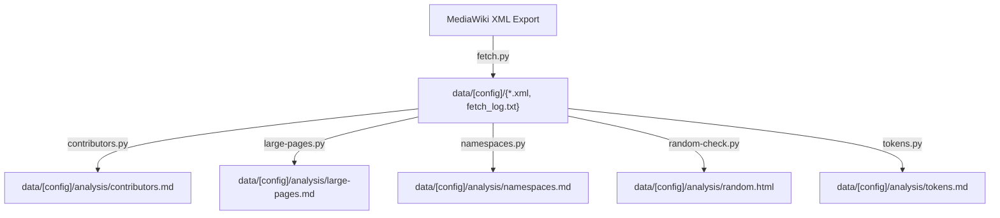

# Tools
'Tools' is a collection of the applications for the small goals.

## Archive Fetching

- **[fetch](fetch/README.md)** - Downloads and extracts MediaWiki XML export archives from various sources including Wikia/Fandom servers.

## Page Analysis

- Contents Analyzers: Analyzes MediaWiki XML exports to avoid redundant content
  - **[large pages](large-pages/README.md)** - Identifies and analyzes the largest pages in a MediaWiki export by content size, providing detailed statistics and direct links to original wiki pages.
  - **[contributors](contributors/README.md)** - Analyzes contributors by page creation count to identify the most active content creators in a MediaWiki wiki.
  - **[namespaces](namespaces/README.md)** - Analyzes content distribution across different namespaces, showing how wiki content is distributed by type (articles, user pages, talk pages, etc.).
  - **[random check](random/README.md)** - Generates an interactive HTML page with a button to jump to random wiki pages for content discovery.
  - **[tokens](tokens/README.md)** - Analyzes token counts for MediaWiki XML exports using tiktoken (OpenAI GPT-4).
  - **dothemall.bash** - Runs all analysis tools in sequence (contributors, large-pages, namespaces, random-check, tokens) after data has been fetched.

## Data Processing Flow

