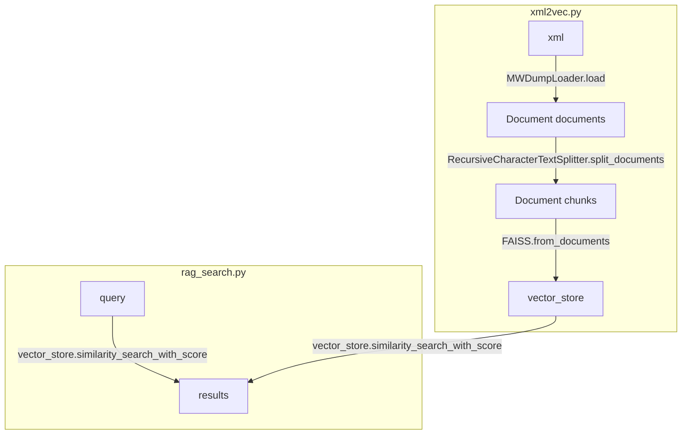

# LangChain RAG System Specification

This RAG system works with any MediaWiki site configured in `config.py`. The default paths shown below use the current site configuration.

## RAG Processing Flow

The LangChain RAG system follows a clear data processing pipeline from MediaWiki XML dumps to searchable vector representations:



## Requirements

To use the RAG system, install the following Python packages:

```bash
pip install langchain langchain-community langchain-text-splitters langchain-openai
pip install langchain-huggingface  # For HuggingFace embeddings (new package)
pip install faiss-cpu  # or faiss-gpu for GPU support
pip install sentence-transformers  # For HuggingFace model downloads
pip install lxml  # For XML parsing
pip install mwxml  # For MediaWiki XML parsing
pip install mwparserfromhell  # For MediaWiki markup parsing
```

## Usage

The RAG system uses a two-step process:

1. **Create vector store** (one-time setup, may take several minutes)
2. **Search** (fast, interactive queries)

### Step 1: Create Vector Store

First, fetch the XML data if you don't have it:

```bash
cd tools/fetch/
python3 fetch.py
```

Then create the vector store:

```bash
cd tools/rag/
python3 xml2vec.py
```

This will:
- Load and process the MediaWiki XML file
- Split documents into chunks
- Create embeddings for all chunks
- Save the vector store to `data/googology-wiki/vector_store.pkl`

### Step 2: Search

Once the vector store is created, you can perform fast searches:

```bash
python3 tools/rag/rag_search.py
```

This starts an interactive search session where you can:
- Enter multiple queries without reloading the vector store
- Exit by typing 'quit', 'exit', or pressing Ctrl+C/Ctrl+D

## Command Line Options

### Vector Store Creation Options

```bash
python3 tools/rag/xml2vec.py [options]

Options:
  --xml-file PATH         Path to XML file (auto-detected if not specified)
  --output PATH           Output path for vector store (default: data/googology-wiki/vector_store.pkl)
  --chunk-size SIZE       Chunk size for text splitting (default: 1000)
  --chunk-overlap SIZE    Chunk overlap for text splitting (default: 200)
  --use-openai            Use OpenAI embeddings (requires OPENAI_API_KEY)
  --embedding-model MODEL HuggingFace model (default: all-MiniLM-L6-v2)
  --force                 Overwrite existing vector store
```

### Search Options

```bash
python3 tools/rag/rag_search.py [query] [options]

Options:
  --cache PATH            Path to vector store file (default: data/googology-wiki/vector_store.pkl)
  --top-k K               Number of results to return (default: 5)
  --score-threshold SCORE Minimum similarity score threshold
```

## Examples

Create vector store with custom settings:
```bash
python3 tools/rag/xml2vec.py --chunk-size 500 --chunk-overlap 100
```

Search with custom parameters:
```bash
python3 tools/rag/rag_search.py "TREE(3)" --top-k 10
```

Search with score threshold:
```bash
python3 tools/rag/rag_search.py "Fast-growing hierarchy" --score-threshold 0.5
```

## Implementation Notes

1. The system uses HuggingFace embeddings by default (specifically the `all-MiniLM-L6-v2` model) to avoid requiring OpenAI API keys.
2. Vector stores are cached to disk for faster subsequent searches.
3. Only main namespace articles (namespace=0) are indexed by default.
4. The MWDumpLoader automatically extracts metadata including title, URL, and page ID from the MediaWiki XML.

### Function References

* **MWDumpLoader**
  * How To: [MediaWiki Dump Loader](https://python.langchain.com/docs/integrations/document_loaders/mediawikidump/)
  * Reference: [MWDumpLoader API](https://python.langchain.com/api_reference/community/document_loaders/langchain_community.document_loaders.mediawikidump.MWDumpLoader.html)

* **RecursiveCharacterTextSplitter**
  * How To: [Text Splitters](https://python.langchain.com/docs/concepts/text_splitters/)
  * Reference: [RecursiveCharacterTextSplitter API](https://python.langchain.com/api_reference/text_splitters/character/langchain_text_splitters.character.RecursiveCharacterTextSplitter.html)

* **FAISS**
  * How To: [FAISS Vector Store](https://python.langchain.com/docs/integrations/vectorstores/faiss/)
  * Reference: [FAISS API](https://python.langchain.com/api_reference/community/vectorstores/langchain_community.vectorstores.faiss.FAISS.html)

### Object Structure Overview

#### [Document](https://python.langchain.com/api_reference/core/documents/langchain_core.documents.base.Document.html) Class
- **page_content**: `str` - Raw text content of the chunk/article
- **metadata**: `dict` - Dictionary containing:
  - **source**: `str` - Original page title (from MWDumpLoader)
  - **title**: `str` - Wiki article title
  - **id**: `str` - Generated page identifier (format: `page_Title_With_Underscores`)
  - **url**: `str` - Full URL to the original wiki page
  - **namespace**: `int` - MediaWiki namespace (0 = main articles)

#### [FAISS](https://python.langchain.com/api_reference/community/vectorstores/langchain_community.vectorstores.faiss.FAISS.html) Vector Store Class
- **index**: `faiss.IndexFlatIP` - FAISS index object containing:
  - **ntotal**: `int` - Total number of stored vectors
  - **d**: `int` - Vector dimension size
  - **get_vector(i)**: `numpy.ndarray` - Retrieve vector at index i
- **docstore**: `InMemoryDocstore` - Document storage containing:
  - **_dict**: `dict[str, Document]` - Document mapping where:
    - **key**: `str` - document_id
    - **value**: `Document` - Document object with page_content and metadata
- **index_to_docstore_id**: `dict[int, str]` - Vector index to document ID mapping where:
  - **key**: `int` - vector_index
  - **value**: `str` - document_id
- **embedding_function**: `BaseEmbeddings` - Embedding function with methods:
  - **embed_query(text)**: `list[float]` - Convert query text to vector
  - **embed_documents(texts)**: `list[list[float]]` - Convert document texts to vectors

#### Search Results Structure
- **results**: `list[tuple[Document, float]]` - List of tuples containing:
  - **[0]**: `tuple[Document, float]` - First result tuple:
    - **[0]**: `Document` - Document object with:
      - **page_content**: `str` - Matching chunk text content
      - **metadata**: `dict` - Original metadata (title, id, url, etc.)
    - **[1]**: `float` - Similarity score (0.0 - 1.0)
  - **[1]**: `tuple[Document, float]` - Second best match
  - **[n]**: `tuple[Document, float]` - nth best match