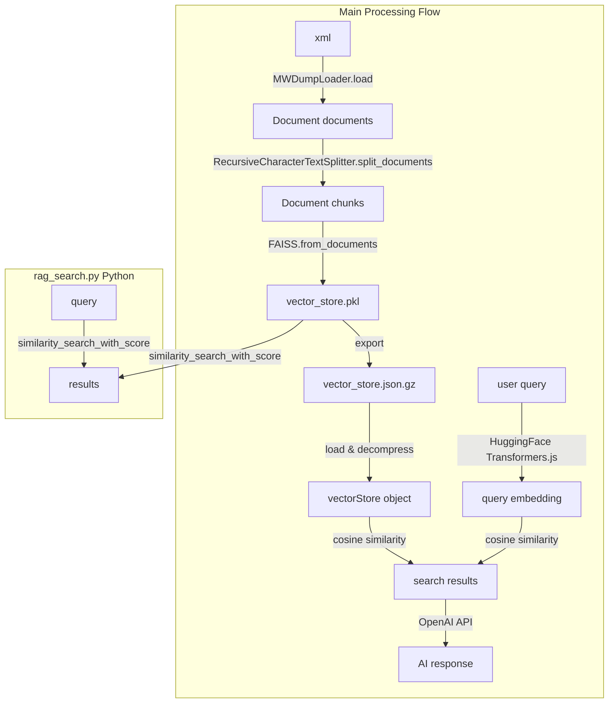

# LangChain RAG System Specification

This RAG system works with any MediaWiki site configured in `config.py`. The default paths shown below use the current site configuration.

## RAG Processing Flow

The LangChain RAG system follows a clear data processing pipeline from MediaWiki XML dumps to searchable vector representations:



## Requirements

To use the RAG system, install the following Python packages:

```bash
pip install langchain langchain-community langchain-text-splitters langchain-openai
pip install langchain-huggingface  # For HuggingFace embeddings (new package)
pip install faiss-cpu  # or faiss-gpu for GPU support
pip install sentence-transformers  # For HuggingFace model downloads
pip install lxml  # For XML parsing
pip install mwxml  # For MediaWiki XML parsing
pip install mwparserfromhell  # For MediaWiki markup parsing
```

## Usage

The RAG system uses a three-step process:

1. **Create vector store** (one-time setup, may take several minutes)
2. **Export to JSON** (for web interface usage)
3. **Search** (fast, interactive queries)

### Step 1: Create Vector Store

First, fetch the XML data if you don't have it:

```bash
cd tools/fetch/
python3 fetch.py
```

Then create the vector store:

```bash
cd tools/rag/
python3 xml2vec.py
```

This will:
- Load and process the MediaWiki XML file
- Split documents into chunks
- Create embeddings for all chunks
- Save the vector store to `data/googology-wiki/vector_store.pkl`

### Step 2: Export to JSON (for Web Interface)

To use the vector store in the web interface, export it to JSON format:

```bash
python3 tools/rag/vec2json.py
```

This will:
- Load the vector store from `data/googology-wiki/vector_store.pkl`
- Export documents and embeddings to JSON format
- Create both uncompressed (`vector_store.json`) and compressed (`vector_store.json.gz`) versions
- Use the document count configured in `data/googology-wiki/config.py` (VECTOR_STORE_SAMPLE_SIZE)

### Step 3: Search

Once the vector store is created, you can perform fast searches:

```bash
python3 tools/rag/rag_search.py
```
```
Loading /
> What is Graham's Number?
============================================================
Result 1 (Score: 0.5130)
============================================================
Title: Graham's Number
URL: https://googology.fandom.com/wiki/Graham's_Number
ID: page_Graham's_Number

Content Preview:
REDIRECT Graham's number

============================================================
Result 2 (Score: 0.5130)
============================================================
Title: G64
URL: https://googology.fandom.com/wiki/G64
ID: page_G64

Content Preview:
REDIRECT Graham's number

============================================================
Result 3 (Score: 0.5130)
============================================================
Title: Graham
URL: https://googology.fandom.com/wiki/Graham
ID: page_Graham

Content Preview:
REDIRECT Graham's number

============================================================
Result 4 (Score: 0.5130)
============================================================
...
```

This starts an interactive search session where you can:
- Enter multiple queries without reloading the vector store
- Exit by typing 'quit', 'exit', or pressing Ctrl+C/Ctrl+D

## Command Line Options

### Vector Store Creation Options

```bash
python3 tools/rag/xml2vec.py [options]
```

**Options:**
- **`--xml-file`**
  - Specifies path to MediaWiki XML dump file
  - Default: Automatically searches for XML files in the data directory
- **`--output`**
  - Sets output path for the vector store pickle file
  - Default: `data/{site}/vector_store.pkl`
- **`--chunk-size`**
  - Controls text chunk size for document splitting
  - Default: 1200 characters, optimized for mathematical content preservation
- **`--chunk-overlap`**
  - Sets overlap between consecutive chunks
  - Default: 300 characters (25% overlap) to maintain concept continuity
- **`--use-openai`**
  - Switches from HuggingFace to OpenAI embeddings
  - Requires: `OPENAI_API_KEY` environment variable
- **`--embedding-model`**
  - Specifies HuggingFace model name
  - Default: `all-MiniLM-L6-v2`
  - Note: Only used when not using OpenAI embeddings
- **`--force`**
  - Overwrites existing vector store file without prompting
  - Useful for automation and updates

### JSON Export Options

```bash
python3 tools/rag/vec2json.py [options]
```

**Options:**
- **`--input`**
  - Specifies path to vector store pickle file
  - Default: `data/{site}/vector_store.pkl`
- **`--output`**
  - Sets output path for the JSON file
  - Default: `data/{site}/vector_store.json`
  - Note: Both uncompressed `.json` and compressed `.json.gz` files are created automatically
- **`--max-docs`**
  - Controls the number of documents to export
  - Default: Uses `VECTOR_STORE_SAMPLE_SIZE` from site config
  - Positive number: Export specified number of documents
  - Zero or negative: Export all documents (ignores config limit)
  - Exceeds total: Automatically exports all available documents

### Search Options

```bash
python3 tools/rag/rag_search.py [query] [options]

Options:
  --cache PATH            Path to vector store file (default: data/googology-wiki/vector_store.pkl)
  --top-k K               Number of results to return (default: 10)
  --score-threshold SCORE Minimum similarity score threshold
```

## Examples

### Vector Store Creation
Uses HuggingFace embeddings and auto-detected XML file:
```bash
python3 tools/rag/xml2vec.py
```

### JSON Export
Uses `VECTOR_STORE_SAMPLE_SIZE` from `data/{site}/config.py`:
```bash
python3 tools/rag/vec2json.py
```

### Search
Interactive search session:
```bash
python3 tools/rag/rag_search.py
```

## Implementation Notes

1. **Chunk size optimization**: Default chunk size is 1200 characters (vs standard 1000) to better preserve mathematical definitions and complex concepts in Googology Wiki.

2. **Enhanced overlap**: Default overlap is 300 characters (25%) to maintain concept continuity, especially important for mathematical notation and cross-references.

3. **Wiki-aware separators**: Custom separator hierarchy prioritizes MediaWiki heading structure (`# ## ### ####`) and list formats for better semantic boundaries.

4. **Embeddings**: Uses HuggingFace embeddings by default (specifically the `all-MiniLM-L6-v2` model) to avoid requiring OpenAI API keys.

5. **Caching**: Vector stores are cached to disk for faster subsequent searches.

6. **Namespace filtering**: All namespaces except excluded ones (File, Template, etc.) are indexed to include user blogs and discussion content.

7. **Metadata extraction**: Enhanced metadata extraction provides proper title, URL, and page ID for search results.

8. **JSON Export Configuration**: The `--max-docs` parameter allows flexible document export:
   - **Default behavior**: Uses `VECTOR_STORE_SAMPLE_SIZE` from `data/{site}/config.py`
   - **Validation**: Automatically uses all documents if the specified count is invalid (≤0) or exceeds total documents
   - **Web interface optimization**: Compressed JSON format (.gz) reduces file size for browser loading

### Function References

* **MWDumpLoader**
  * How To: [MediaWiki Dump Loader](https://python.langchain.com/docs/integrations/document_loaders/mediawikidump/)
  * Reference: [MWDumpLoader API](https://python.langchain.com/api_reference/community/document_loaders/langchain_community.document_loaders.mediawikidump.MWDumpLoader.html)

* **RecursiveCharacterTextSplitter**
  * How To: [Text Splitters](https://python.langchain.com/docs/concepts/text_splitters/)
  * Reference: [RecursiveCharacterTextSplitter API](https://python.langchain.com/api_reference/text_splitters/character/langchain_text_splitters.character.RecursiveCharacterTextSplitter.html)

* **FAISS**
  * How To: [FAISS Vector Store](https://python.langchain.com/docs/integrations/vectorstores/faiss/)
  * Reference: [FAISS API](https://python.langchain.com/api_reference/community/vectorstores/langchain_community.vectorstores.faiss.FAISS.html)

### Object Structure Overview

#### [Document](https://python.langchain.com/api_reference/core/documents/langchain_core.documents.base.Document.html) Class
- **page_content**: `str` - Raw text content of the chunk/article
- **metadata**: `dict` - Dictionary containing:
  - **source**: `str` - Original page title (from MWDumpLoader)
  - **title**: `str` - Wiki article title
  - **id**: `str` - Generated page identifier (format: `page_Title_With_Underscores`)
  - **url**: `str` - Full URL to the original wiki page
  - **namespace**: `int` - MediaWiki namespace (0 = main articles)

#### [FAISS](https://python.langchain.com/api_reference/community/vectorstores/langchain_community.vectorstores.faiss.FAISS.html) Vector Store Class
- **index**: `faiss.IndexFlatIP` - FAISS index object containing:
  - **ntotal**: `int` - Total number of stored vectors
  - **d**: `int` - Vector dimension size
  - **get_vector(i)**: `numpy.ndarray` - Retrieve vector at index i
- **docstore**: `InMemoryDocstore` - Document storage containing:
  - **_dict**: `dict[str, Document]` - Document mapping where:
    - **key**: `str` - document_id
    - **value**: `Document` - Document object with page_content and metadata
- **index_to_docstore_id**: `dict[int, str]` - Vector index to document ID mapping where:
  - **key**: `int` - vector_index
  - **value**: `str` - document_id
- **embedding_function**: `BaseEmbeddings` - Embedding function with methods:
  - **embed_query(text)**: `list[float]` - Convert query text to vector
  - **embed_documents(texts)**: `list[list[float]]` - Convert document texts to vectors

#### Search Results Structure
- **results**: `list[tuple[Document, float]]` - List of tuples containing:
  - **[0]**: `tuple[Document, float]` - First result tuple:
    - **[0]**: `Document` - Document object with:
      - **page_content**: `str` - Matching chunk text content
      - **metadata**: `dict` - Original metadata (title, id, url, etc.)
    - **[1]**: `float` - Similarity score (0.0 - 1.0)
  - **[1]**: `tuple[Document, float]` - Second best match
  - **[n]**: `tuple[Document, float]` - nth best match
